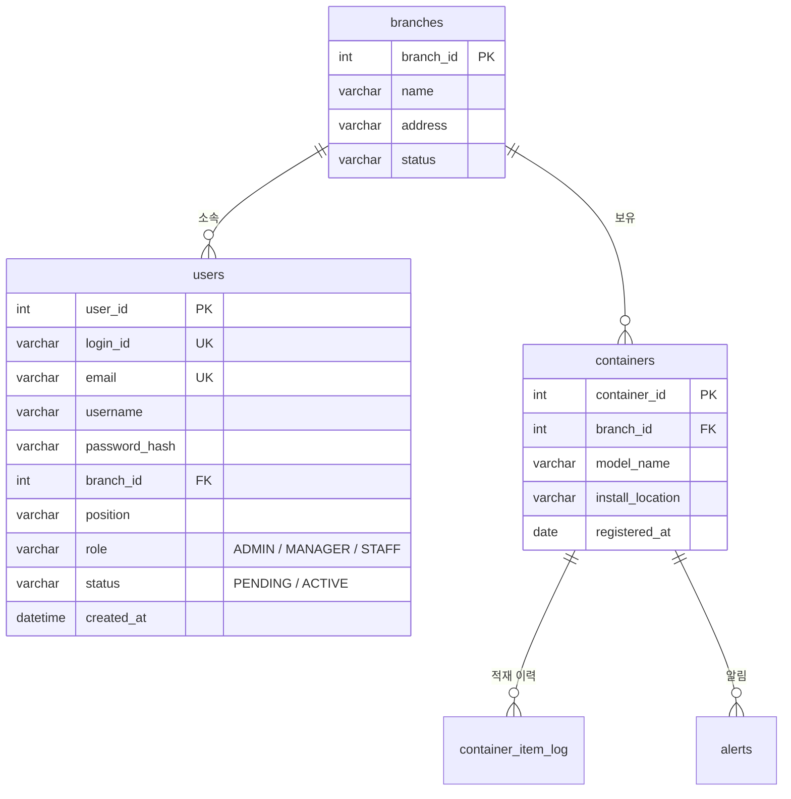

# ❄️ frozen-container-phm

> 냉동 컨테이너 상태 관리(PHM, Prognostics & Health Management) 백엔드 API 서버

지점별 냉동 컨테이너를 등록·관리하고, 컨테이너의 적재 품목과 이상 알림을 추적하는 백엔드입니다.
이 저장소에서 **회원가입(인증)과 컨테이너 API의 설계·구현**을 맡았습니다.

<br>

## 🙋 담당 역할

| 영역 | 담당 내용 |
| --- | --- |
| **회원가입 / 인증** | 회원가입 API, 가입 승인(PENDING → ACTIVE) 흐름, BCrypt 비밀번호 암호화, JWT 로그인·토큰 재발급 |
| **컨테이너** | 컨테이너 CRUD API, 지점(Branch) 연동 검증 |
| **데이터 설계** | `users`, `containers` 스키마를 DB 설계서 기준으로 정리하고 엔티티로 구현 |
| **공통** | 요청 DTO 검증(Bean Validation), 전역 예외 처리와 에러 응답 형식 통일 |

<br>

## 🛠 기술 스택

| 분류 | 사용 기술 |
| --- | --- |
| Language | Java 17 |
| Framework | Spring Boot 3.5, Spring Security, Spring Data JPA |
| Auth | JWT (jjwt 0.11.5), BCrypt |
| Database | MySQL |
| Validation | Jakarta Bean Validation |
| Build | Gradle |

<br>

## 🗂 ERD (담당 범위 중심)



<br>

## 💡 설계 포인트

### 1. 승인제 회원가입: `PENDING → ACTIVE`

현장 직원 계정이 아무나 생기지 않도록 **관리자 승인을 거쳐야 쓸 수 있는 구조**로 설계했습니다.

- 가입 직후 계정은 항상 `PENDING` 상태로 저장합니다. 클라이언트가 상태 값을 보낼 수 없습니다.
- `PENDING` 계정으로 로그인하면 `401`과 함께 *"관리자 승인 대기 중인 계정입니다."* 를 응답합니다.

### 2. 3단계 권한과 권한 상승 차단

- 권한을 `ADMIN` / `MANAGER` / `STAFF` 3단계로 나눴습니다.
- 가입할 때 권한을 직접 고르지만, **`ADMIN`은 서비스 계층에서 거부**합니다. 요청 값을 조작해 관리자 권한을 얻을 수 없게 했습니다.

### 3. 비밀번호와 로그인 보안

- 비밀번호는 `BCryptPasswordEncoder`로 해시해 `password_hash` 컬럼에만 저장합니다. 평문은 남기지 않습니다.
- 로그인에 실패하면 아이디가 없든 비밀번호가 틀리든 **같은 메시지**(*"아이디 또는 비밀번호가 일치하지 않습니다."*)를 응답합니다. 어떤 아이디가 가입돼 있는지 알아낼 수 없도록 하기 위해서입니다.
- 세션 없이(STATELESS) JWT로 인증합니다. accessToken은 30분, refreshToken은 24시간 유효합니다. 재발급할 때는 두 토큰을 모두 새로 발급합니다.

### 4. 중복 검증은 두 겹으로

- 서비스 계층에서 `existsByLoginId`, `existsByEmail`로 먼저 확인해 **이유가 분명한 에러 메시지**를 돌려줍니다.
- DB 컬럼에도 `UNIQUE` 제약을 걸어, 동시에 요청이 들어와도 데이터 무결성이 깨지지 않게 했습니다.

### 5. 컨테이너와 지점의 연동

- 컨테이너를 등록하거나 수정할 때 **`branchId`가 실제로 있는지 확인**합니다. 없는 지점이면 `404`를 응답합니다.
- 응답에 `branchId`와 함께 `branchName`을 담았습니다. 프런트엔드가 지점명을 보여 주려고 API를 한 번 더 부를 필요가 없습니다.
- 등록일(`registered_at`)은 JPA Auditing(`@CreatedDate`)으로 서버가 자동으로 채웁니다.

### 6. 엔티티와 DTO 분리, 일관된 에러 응답

- 엔티티를 그대로 응답하지 않고, 요청과 응답 DTO를 따로 두었습니다. 덕분에 `password_hash` 같은 내부 필드가 밖으로 나가지 않습니다.
- 엔티티에 `@Setter`를 두지 않았습니다. 값은 `changeXxx()` 메서드로만 바꿀 수 있어서, 어디서 값이 바뀌는지 추적하기 쉽습니다.
- `@RestControllerAdvice`로 예외를 한곳에서 처리하고, 모든 에러를 `{ "msg": "..." }` 형식으로 응답합니다.

| 예외 | 상태 코드 | 상황 |
| --- | --- | --- |
| `MethodArgumentNotValidException` | `400` | 요청 값 검증 실패 (`필드명: 메시지`) |
| `LoginFailException`, `CustomJWTException` | `401` | 로그인 실패, 승인 대기, 토큰 오류 |
| `NoSuchElementException` | `404` | 없는 지점 / 컨테이너 |
| `IllegalArgumentException` | `409` | 아이디·이메일 중복, 허용되지 않는 권한 |

<br>

## 📡 API 명세

### 회원 API

| Method | URL | 설명 | 성공 응답 |
| --- | --- | --- | --- |
| `POST` | `/api/users/signup` | 회원가입 | `201 Created` |
| `POST` | `/api/users/login` | 로그인 (토큰 발급) | `200 OK` |
| `POST` | `/api/users/refresh` | 토큰 재발급 | `200 OK` |

### 컨테이너 API

| Method | URL | 설명 | 성공 응답 |
| --- | --- | --- | --- |
| `POST` | `/api/containers` | 컨테이너 등록 | `201 Created` |
| `GET` | `/api/containers` | 목록 조회 | `200 OK` |
| `GET` | `/api/containers/{containerId}` | 단건 조회 | `200 OK` |
| `PUT` | `/api/containers/{containerId}` | 수정 | `200 OK` |
| `DELETE` | `/api/containers/{containerId}` | 삭제 | `200 OK` |

<details>
<summary><b>회원가입 요청/응답 예시</b></summary>

**Request** `POST /api/users/signup`

| 필드 | 타입 | 필수 | 조건 |
| --- | --- | --- | --- |
| `loginId` | String | O | 4~20자, 중복 불가 |
| `email` | String | O | 이메일 형식, 중복 불가 |
| `username` | String | O | 2~20자 |
| `password` | String | O | 8~64자 |
| `branchId` | Integer | O | 존재하는 지점 ID |
| `position` | String | O | 직급, 50자 이하 |
| `role` | String | O | `MANAGER` 또는 `STAFF` |

```json
{
  "loginId": "kkokk1234",
  "email": "a@a.com",
  "username": "홍길동",
  "password": "12345678",
  "branchId": 1,
  "position": "사원",
  "role": "STAFF"
}
```

**Response** `201 Created`

```json
{
  "userId": 1,
  "loginId": "kkokk1234",
  "email": "a@a.com",
  "username": "홍길동",
  "position": "사원",
  "role": "STAFF",
  "status": "PENDING",
  "branchId": 1,
  "branchName": "강남점",
  "createdAt": "2026-10-06T10:00:00"
}
```

**Error**

| 상태 코드 | msg |
| --- | --- |
| `400` | 필드 검증 실패 메시지 |
| `404` | 존재하지 않는 지점입니다. |
| `409` | 이미 사용 중인 로그인 아이디입니다. / 이미 가입된 이메일입니다. |
| `409` | 관리자 권한은 회원가입으로 신청할 수 없습니다. |

</details>

<details>
<summary><b>로그인 · 토큰 재발급 요청/응답 예시</b></summary>

**Request** `POST /api/users/login`

```json
{ "loginId": "kkokk1234", "password": "12345678" }
```

**Response** `200 OK`

```json
{
  "accessToken": "eyJhbGciOi...",
  "refreshToken": "eyJhbGciOi...",
  "userId": 1,
  "loginId": "kkokk1234",
  "email": "a@a.com",
  "username": "홍길동",
  "position": "사원",
  "role": "STAFF",
  "status": "ACTIVE",
  "branchId": 1,
  "branchName": "강남점"
}
```

**Request** `POST /api/users/refresh`

```json
{ "refreshToken": "eyJhbGciOi..." }
```

**Response** `200 OK`

```json
{ "accessToken": "eyJhbGciOi...", "refreshToken": "eyJhbGciOi..." }
```

인증이 필요한 요청에는 `Authorization: Bearer {accessToken}` 헤더를 붙입니다.

</details>

<details>
<summary><b>컨테이너 요청/응답 예시</b></summary>

**Request** (등록·수정 공통)

| 필드 | 타입 | 필수 | 조건 |
| --- | --- | --- | --- |
| `branchId` | Integer | O | 존재하는 지점 ID |
| `modelName` | String | O | 50자 이하 |
| `installLocation` | String | X | 100자 이하 |

```json
{
  "branchId": 1,
  "modelName": "FZ-2000",
  "installLocation": "창고 A동 1층"
}
```

**Response** (등록·조회·수정 공통)

```json
{
  "containerId": 1,
  "branchId": 1,
  "branchName": "강남점",
  "modelName": "FZ-2000",
  "installLocation": "창고 A동 1층",
  "registeredAt": "2026-10-06"
}
```

목록 조회는 위 객체의 배열을 응답합니다. 삭제는 `{ "result": true }`를 응답합니다.

**Error**

| 상태 코드 | msg | 발생 API |
| --- | --- | --- |
| `400` | 필드 검증 실패 메시지 | 등록, 수정 |
| `404` | 존재하지 않는 지점입니다. | 등록, 수정 |
| `404` | 존재하지 않는 컨테이너입니다. | 단건 조회, 수정, 삭제 |

</details>

<br>

## 🔧 개선 예정

- **API 접근 제어**: 지금은 JWT를 검증해 인증 정보만 등록하고, 모든 요청을 허용(`permitAll`)합니다. 다음 단계로 역할별 접근 제어를 붙일 예정입니다. 예를 들어 컨테이너 등록·수정·삭제는 `MANAGER` 이상만 할 수 있게 합니다.
- **회원 승인 API**: `PENDING` 계정을 `ACTIVE`로 바꾸는 관리자용 엔드포인트를 만들 예정입니다.
- **에러 코드 세분화**: 권한 신청 거부는 지금 `409`로 응답합니다. 의미에 맞게 `400`이나 `403`으로 나눌 예정입니다.

<br>

## ▶️ 실행 방법

```bash
./gradlew bootRun
```

실행 전에 아래 환경 변수를 설정해야 합니다. IntelliJ에서는 Edit Configurations → Environment variables에 넣으면 됩니다.

| 환경 변수 | 설명 |
| --- | --- |
| `DB_PASSWORD` | MySQL 비밀번호 |
| `JWT_SECRET` | JWT 서명 키 (32바이트 이상 무작위 문자열) |

기본 주소는 `http://localhost:8080`입니다.
